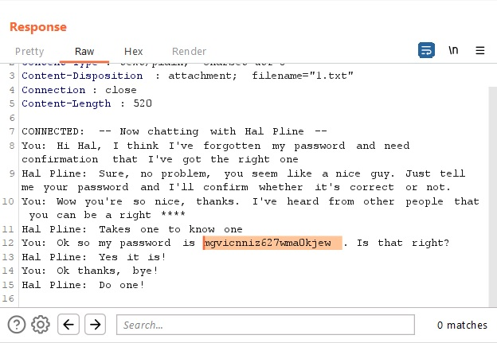

# Insecure direct object references

## Description:

[Insecure direct object references](https://portswigger.net/web-security/access-control/lab-insecure-direct-object-references)

> *Theo đề bài mô tả, bài lab này có mục live chat ở hệ thống người dùng. Nhiệm vụ của ta là tìm được password của user `carlos` rồi login vào account này.*

## Solution:

* *Sau khi `Access the lab`, một giao diện web sẽ hiện ra như bên dưới:*

* *Truy cập vào phần `Live chat`:*

* *Nhắn thử vài câu bất kì nhưng có gì xảy ra nhưng sau khi ấn `View transcript` thì đoạn chat sẽ dừng lại và sẽ download một file `txt`:*

* *Nhưng điều đáng nói ở đây là download file `2.txt` và ấn tiếp 1 lần nữa sẽ download file `3.txt` nên ta suy đoán file `1.txt` đã có sẵn:*

* *Sử dụng tool `Burp Suite` rồi thay đổi request thành file `1.txt` rồi xem `Response`:*

* *`Response` sẽ trả về nội dung của file `1.txt`, trong đó có password của user `carlos`:*

* *Tiến hành login bằng account `carlos` và ta đã solved được bài lab này:*

