# Referer-based access control

## Description:

[Referer-based access control](https://portswigger.net/web-security/access-control/lab-referer-based-access-control)

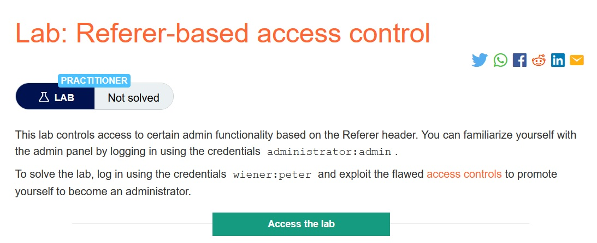

> *Theo mô tả, lab này kiểm soát chức năng admin dựa trên `Referer header`. Ta có thể làm quen với bảng admin bằng cách login bằng account  `administrator:admin`. Nhiệm vụ là login bằng account `wiener:peter` và khai thác lỗ hổng `access control` và set account này thành admin.*

## Solution:

* *Sau khi `Access the lab`, một giao diện web sẽ hiện ra:*

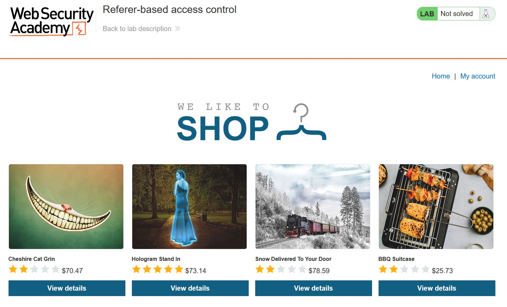

* *Login bằng account `administrator:admin`:*

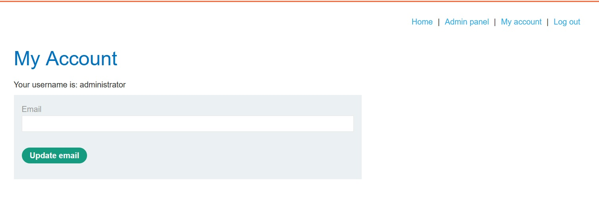

* *Ở giao diện `Admin panel`, ta có thể thay đổi role của user thành `NORMAL` hoặc thành `ADMIN`:*

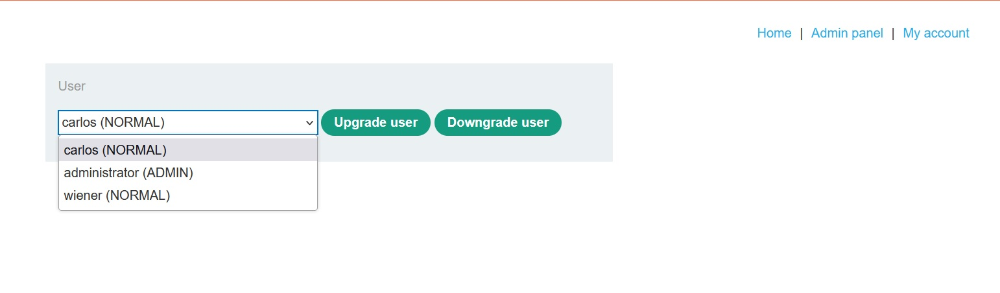

* *Ta thử thay đổi user `wiener` thành `ADMIN`:*

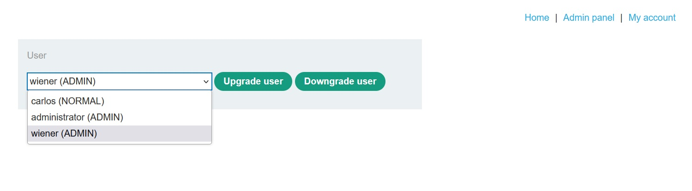

* *Rồi login vào account `wiener:peter`:*

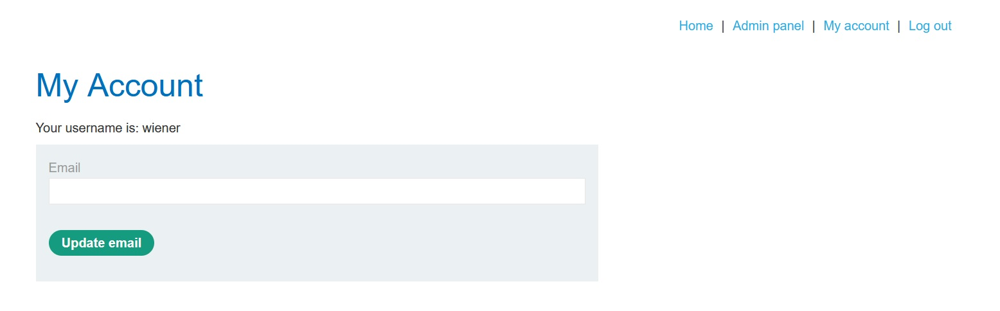

* *Và tất nhiên không có gì xảy ra cả vì không thể dễ như vậy được =))))*

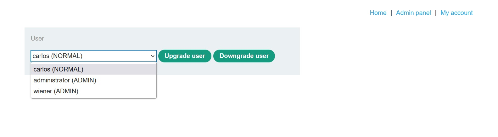

* *Ta đổi lại user `wiener` thành `NORMAL`:*

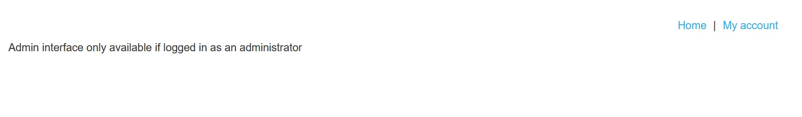

* *Sử dụng tool `Burp Suite` rồi bắt request khi `Upgrade` `carlos` thành `ADMIN`:*

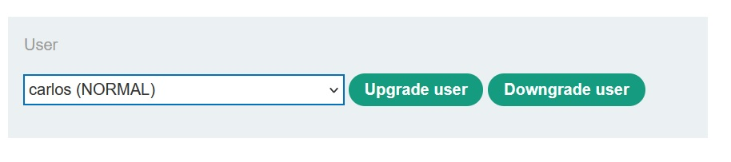

* *Ta thấy ở header request có `/admin-roles ?` và `username & action`:*

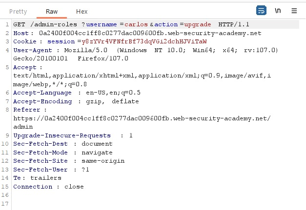

> *`action=upgrade` không cần thay đổi, `username` sẽ phải thay đổi thành `wiener`. Nhưng như vậy thì sẽ chỉ thay đổi như ở bên trên, vấn đề ở nằm ở cookie. Theo mô tả, ta phải sử dụng account `wiener` để thay đổi role nhưng ta đang ở session của `admin`.

* *Sử dụng `Private Window`, login bằng account `wiener:peter` rồi lấy cookie của user này:*

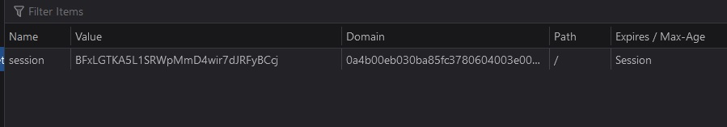

* *Thay đổi user và cookie và ta đã set được role của user `wiener` và ta đã solved được bài lab này:*

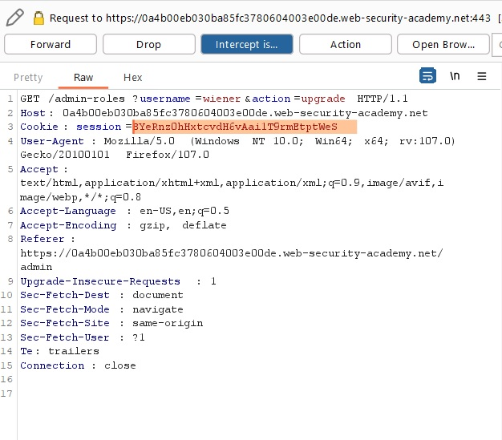

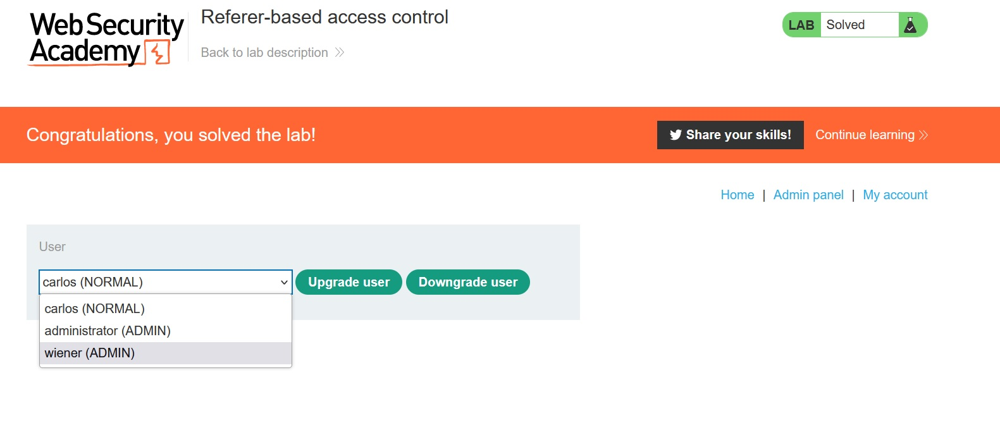