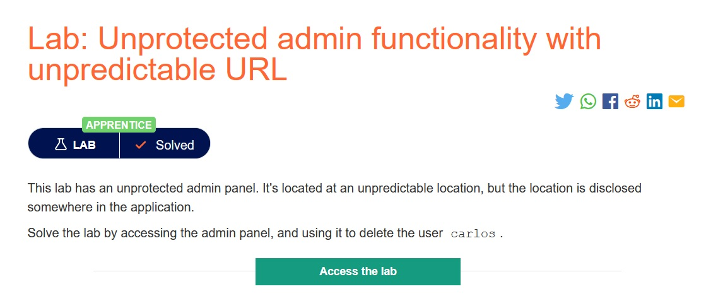
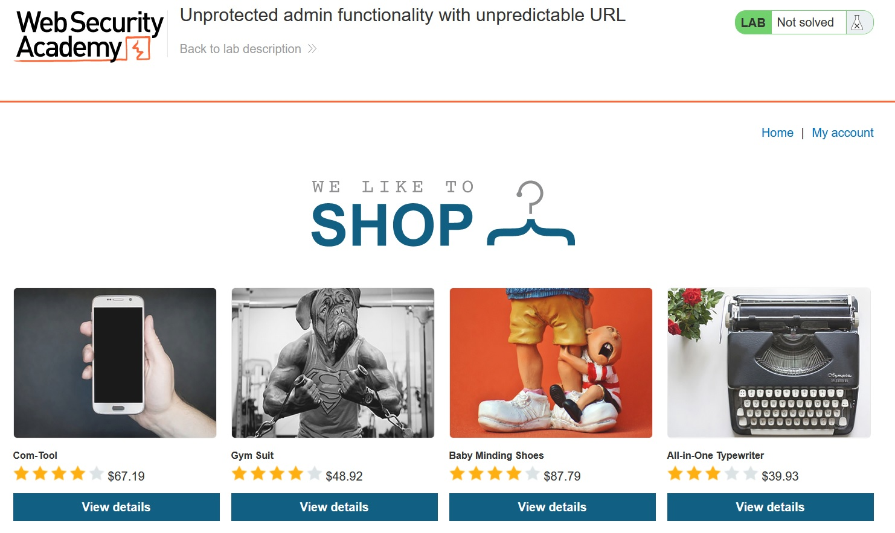
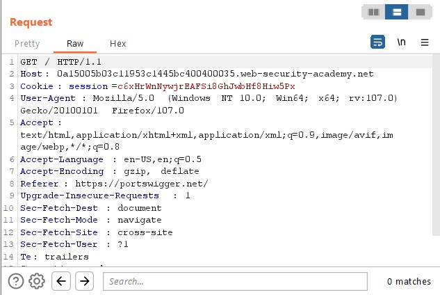
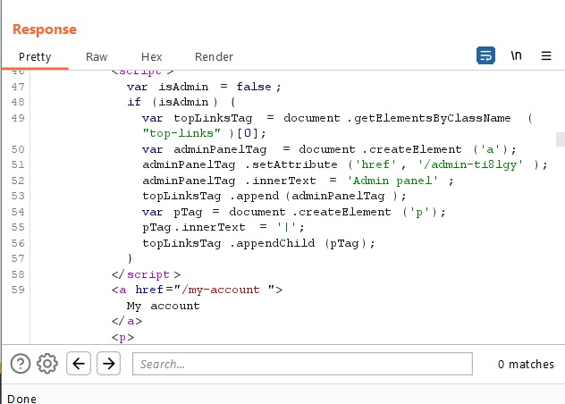
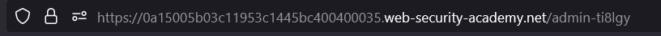
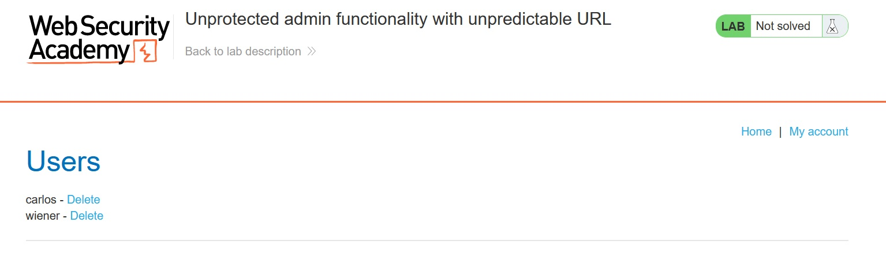
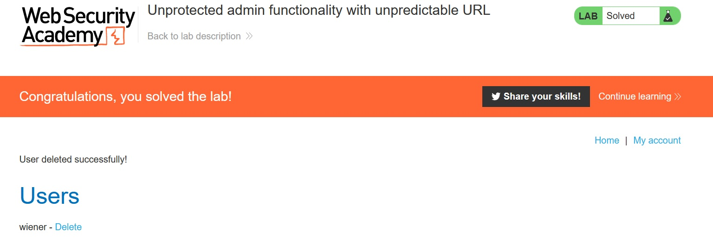

# Unprotected admin functionality with unpredictable URL

## Description:

[Unprotected admin functionality with unpredictable URL](https://portswigger.net/web-security/access-control/lab-unprotected-admin-functionality-with-unpredictable-url)

> *Theo đề bài mô tả, có một bảng admin ở trong trang web này nhưng vị trí bị ẩn đi. Nhiệm vụ của ta là truy cập bảng admin và xóa user `carlos`.*

## Solution:

* *Sau khi `Access the lab`, một giao diện web sẽ hiện ra như bên dưới:*

* *Ta thử truy cập vào file `robots.txt` nhưng không thành công.*

* *Sử dụng tool `Burp Suite` rồi ấn `Home` và bắt request.*

* *Nhưng ta không thấy có gì liên quan đến `admin` ở request:*

* *Ta kiểm tra `Respone` thì thấy có một đoạn js có liên quan đến `admin`, trong đó có một biến là `adminPanelTag` và có herf url ở cuối là `/admin-ti8lgy`.*

* *Thêm đoạn đó vào cuối url:*

* *Ta có thể truy cập được vào bảng `admin`:*

* *Sau khi xóa user `carlos`, ta đã solved được bài lab này:*

