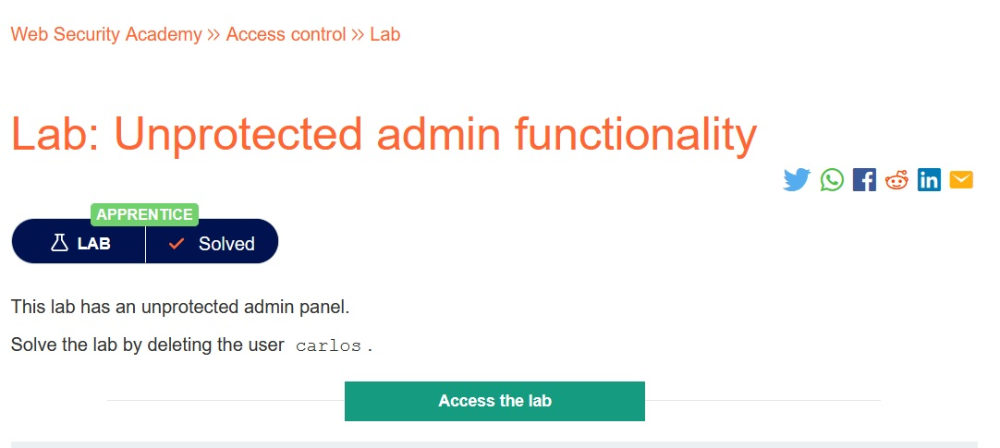
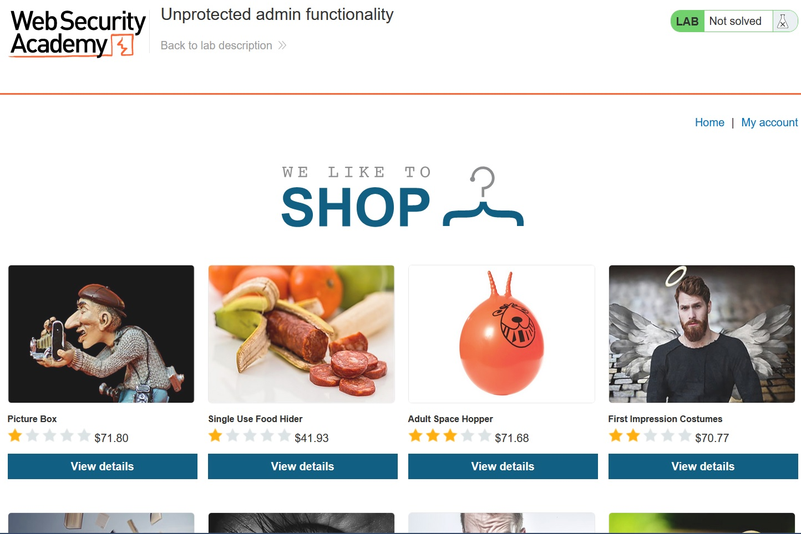
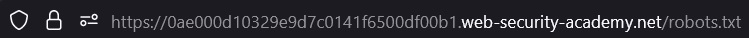
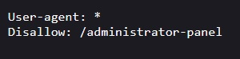
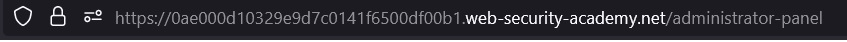
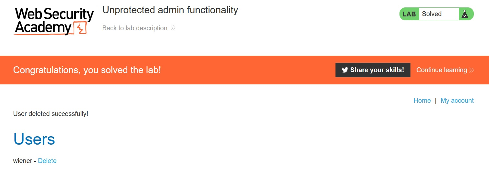

# Unprotected admin functionality

## Description:

[Unprotected admin functionality](https://portswigger.net/web-security/access-control/lab-unprotected-admin-functionality)

> *Theo đề bài mô tả, trang web có một bảng admin nhưng không được bảo vệ, nhiệm vụ của ta là truy cập và bảng admin và xóa user `carlos`.*

## Solution:

* *Sau khi `Access the lab`, một giao diện web sẽ hiển ra:*

* *Ta thử truy cập vào /admin /admin.php nhưng không được, ta thử truy cập vào file ẩn `robots.txt`:*

* *Sau khi truy cập vào file `robots.txt`, ta có thể thấy được phần `Disallow` của trang web là `/administrator-panel`, đó là bảng admin mà ta cần truy cập:*

* *Ta thêm `/administrator-panel` vào url:*

* *Sau khi dán, ta đã có thể truy cập vào bảng admin:*

* *Tiến hành xóa user `carlos` và ta đã solved được lab này:*

