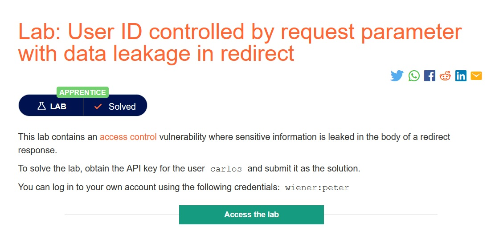
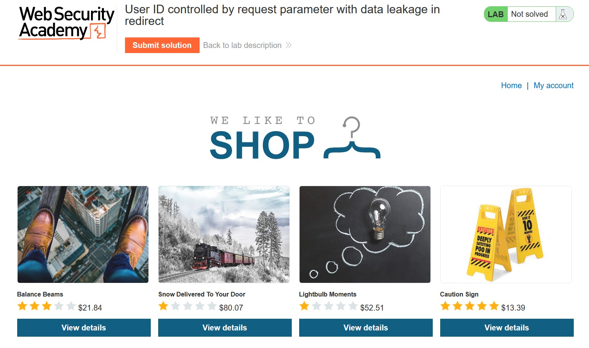
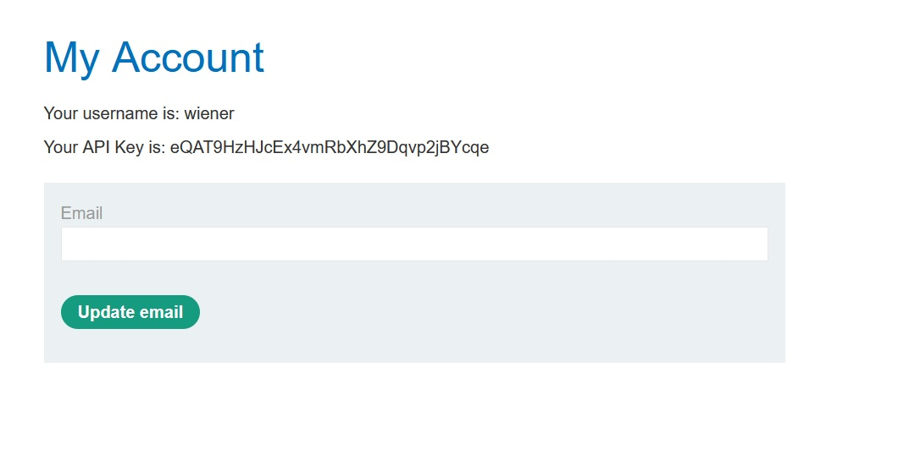
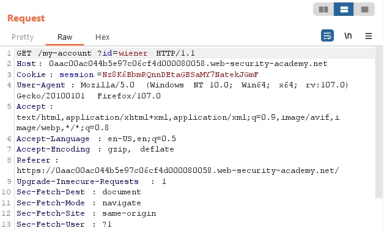
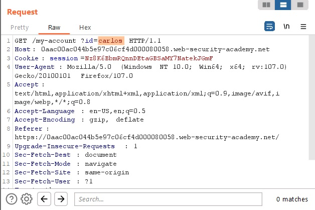
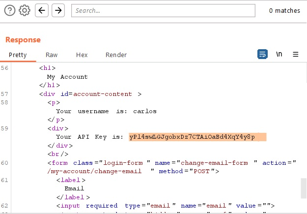
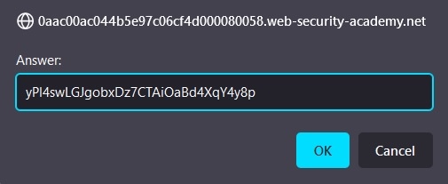
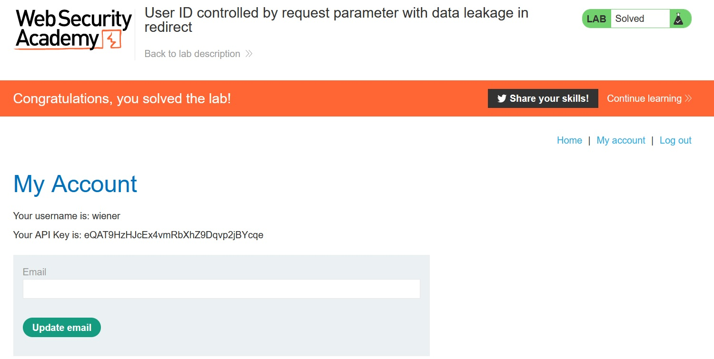

# User ID controlled by request parameter with data leakage in redirect

## Description:

[User ID controlled by request parameter with data leakage in redirect](https://portswigger.net/web-security/access-control/lab-user-id-controlled-by-request-parameter-with-data-leakage-in-redirect)

> *Theo đề bài mô tả, bài lab này có chứa lỗ hổng `access control` bị lộ ra ở phần thân của phần chuyển hướng. Nhiệm vụ của ta là tìm mã API của user `carlos`, ta có thể dùng account `wiener:peter`*.

## Solution:

* *Sau khi `Access the lab`, sẽ có một giao diện web như bên dưới:*

* *Login bằng account `wiener:peter`:*

* *Theo đề bài, đây là một bài lab liên quan đến thông tin khi redirect trang, nên ta chuyển sang page `Home` rồi bật tool `Burp Suite` rồi bắt request khi chuyển hướng về trang `My account`:*

* *Ở đây ta thấy có thông tin `?id=wiener`, ta đổi `wiener` thành `carlos`:*

* *Respone trả về sẽ có mã API của user `carlos`:*

* *Submit mã API này và ta đã solved được bài lab này:*

