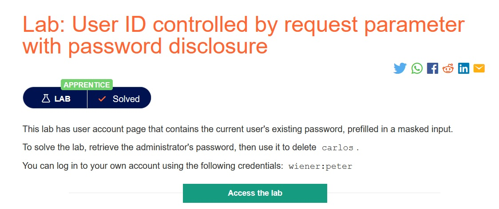
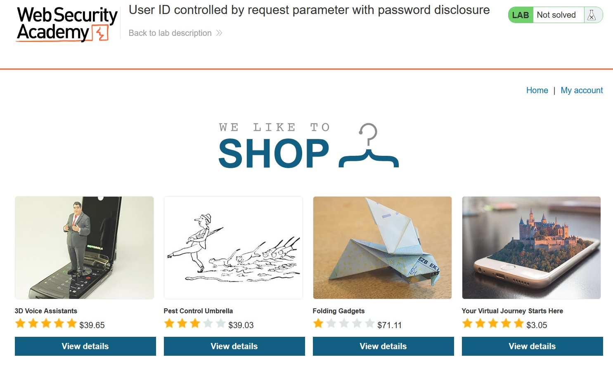
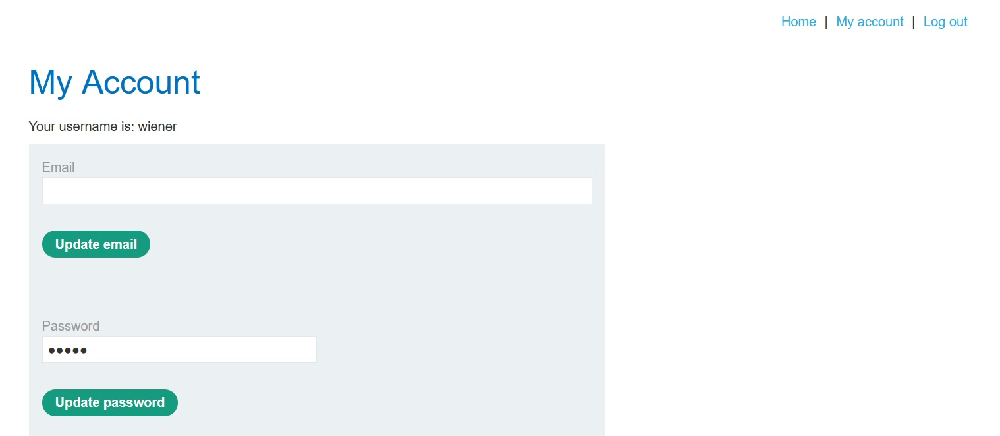
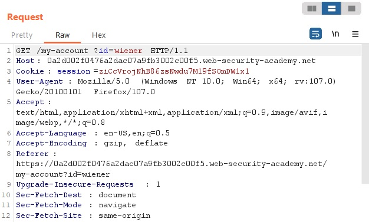
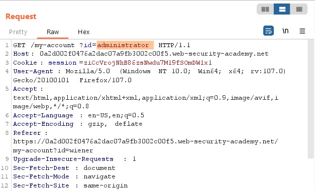
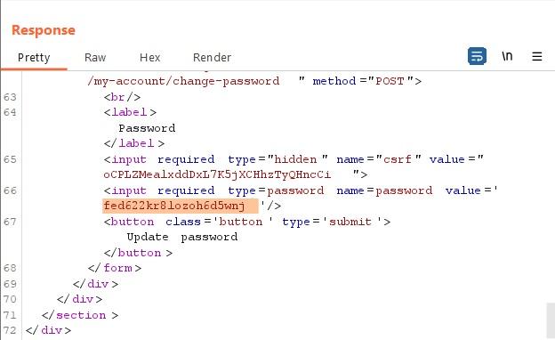
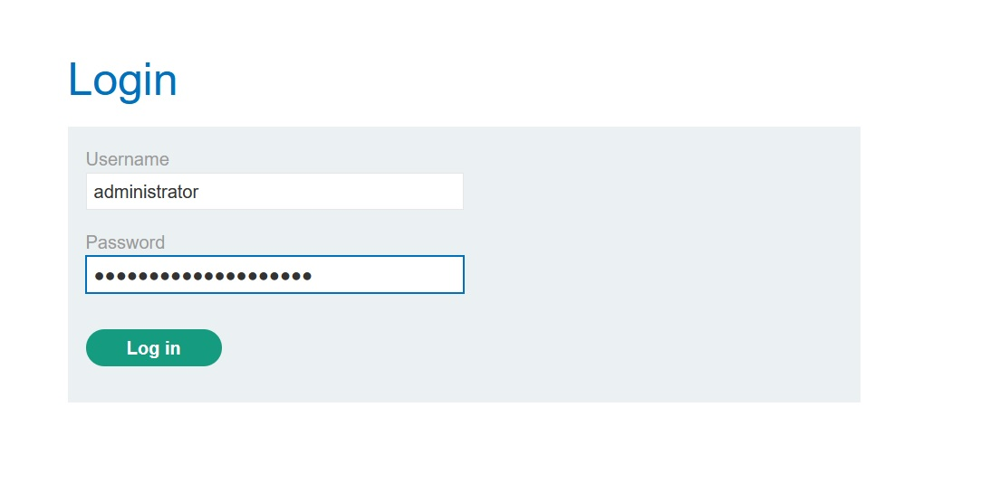
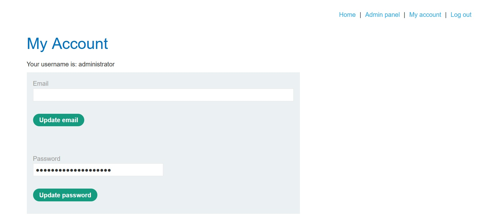
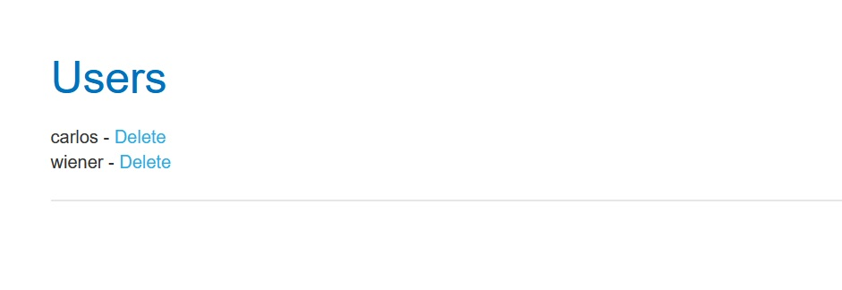
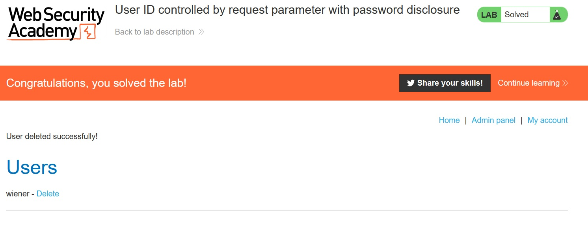

# User ID controlled by request parameter with password disclosure

## Description:

[User ID controlled by request parameter with password disclosure](https://portswigger.net/web-security/access-control/lab-user-id-controlled-by-request-parameter-with-password-disclosure)

> *Theo đề bài mô tả, ở trang tài khoản của người dùng có chức năng cập nhật mật khẩu và mật khẩu được hiện điền sẵn ở đó. Nhiệm vụ của ta là lấy lại được mật khẩu của `administator` rồi đăng nhập xóa user `carlos`. Ta có thể dùng account `wiener:peter`.*

## Solution:

* *Sau khi `Access the lab`, một giao diện web sẽ hiện ra như bên dưới:*

* *Login bằng account `wiener:peter`:*

> *Ta thấy sau khi đăng nhập, phần password sẽ hiện như ở bên dưới:*

* *Sử dụng tool `Burp Suite` để bắt request khi truy cập vào trang `My account`, ta thấy có `?id=wiener`:*

* *Thay đổi `wiener` thành `administrator` rồi kiểm tra `Respone`:*

* *Ở `Respone` trả về trang tài khoản của admin và tất nhiên có cả password có value như ở dưới:*

* *Sau khi biết password của administrator, tiến hành login:*

* *Ở account của administrator có thêm `Admin panel`:*

* *Tiến hành xóa user `carlos` và ta đã solved được bài lab này:*

