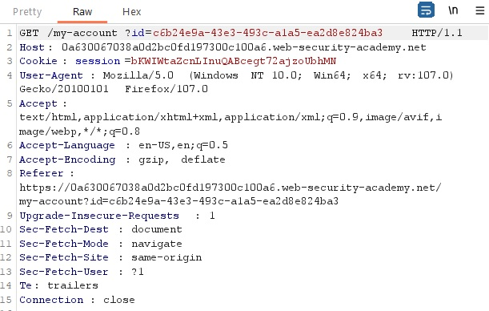
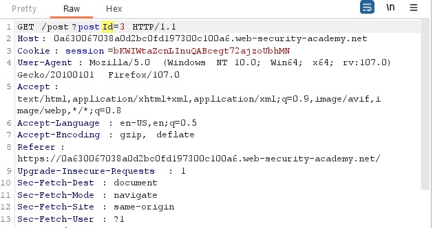

# User ID controlled by request parameter, with unpredictable user IDs

## Description:

[User ID controlled by request parameter, with unpredictable user IDs](https://portswigger.net/web-security/access-control/lab-user-id-controlled-by-request-parameter-with-unpredictable-user-ids)

* *Theo đề bài mô tả, có một lỗ hổng truy nhập phân quyền theo chiều ngang nhưng được mã hóa bằng GUIDs. Nhiệm vụ của chúng ta là tìm được GUIDs của user `carlos` và tìm mã API của user này. Ta có thể sử dụng account `wiener:peter`.*

## Solution:

* *Một giao diện web sẽ hiển ra sau khi `Access the lab`:*

* *Đăng nhập bằng account `wiener:peter`:*

* *Sử dụng tool `Burp Suite` bắt request của user, ta thấy id của wiener đã được mã hóa, giờ ta phải tìm id đã được mã hóa của user `carlos`:*

* *Ta thấy phần `Home` có các bài đăng của các user:*

* *Ta tìm một bài đăng của author `carlos`:*

* *Rồi sau đó bắt request rồi chuyển sang `Repeater`:*

* *Ở phần respone có trả về author và id của `carlos` như trong hình dưới:*

* *Trở về sửa đổi request của `My account` đổi GUIDs của `wiener` thành GUIDs của `carlos` mới tìm được lúc trước:*

* *Ở phần respone có trả về mã API của `carlos`:*

* *Sau khi submit mã API của `carlos`, ta đã solved được bài lab này:*

