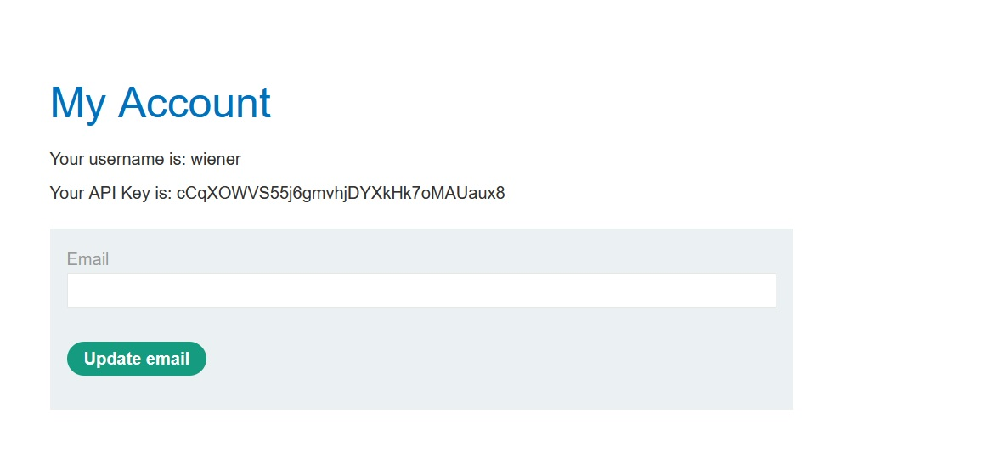

# User ID controlled by request parameter

## Description:

[User ID controlled by request parameter](https://portswigger.net/web-security/access-control/lab-user-id-controlled-by-request-parameter)

> *Theo đề bài mô tả, trang web này có lỗ hổng leo quyền theo chiều ngang. Nhiệm vụ của chúng ta là tìm được mã API của user `carlos`. Ta có thể dùng account `wiener:peter`.*

## Solution:

* *Đây là giao diện web sau khi ta truy cập đường link:*

* *Sau khi đăng nhập với tài khoản, đây là giao diện của người dùng, có mã API của user `wiener`:*

* *Sử dụng tool `Burp Suite` để bắt request, ta thấy dòng url có `?id=wiener`:*

* *Đổi `wiener` thành `carlos` rồi send request:*

* *Trong phần respone kéo xuống ta sẽ thấy mã API của user `carlos`.*

* *Nhập mã API của `carlos` và ta đã solved được bài lab này:* 

