# User role can be modified in user profile

## Description:

[User role can be modified in user profile](https://portswigger.net/web-security/access-control/lab-user-role-can-be-modified-in-user-profile)

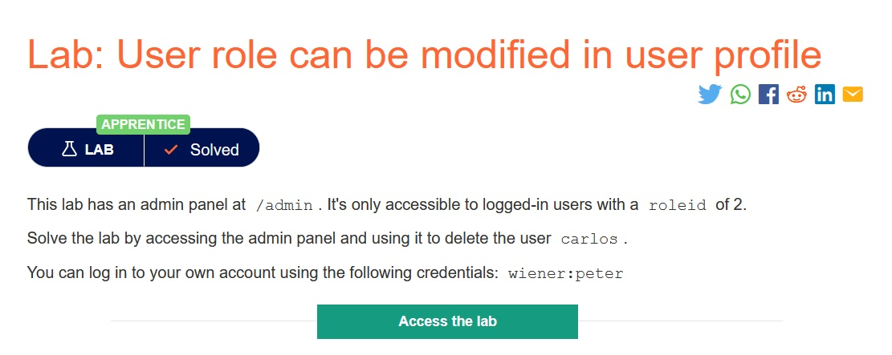

> *Theo đề bài mô tả, trong trang web có một bảng admin ở `/admin` nhưng chỉ có những user có `roleid=2` mới có thể truy cập được bảng admin. Nhiệm vụ của ta là truy cập bảng admin và xóa user `carlos`, ta có thể dùng account `weiner:peter`.*

## Solution:

* *Sau khi truy cập đường link, một giao diện web sẽ hiện ra:*

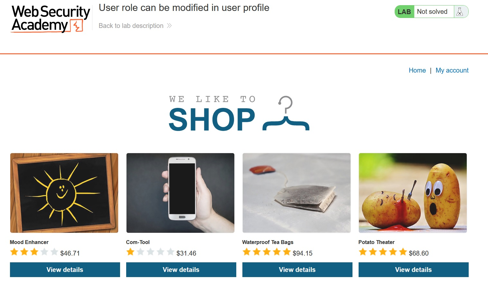

* *Sau khi đăng nhập sẽ có giao diện như hình dưới:*

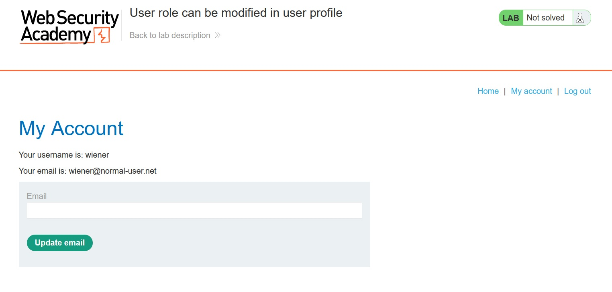

* *Ta thử truy cập vào /admin nhưng không được:*

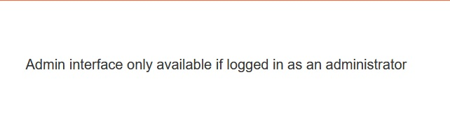

* *Khởi động tool `Burp Suite` và bắt request nhưng ta không thấy header gì liên quan tới role:*

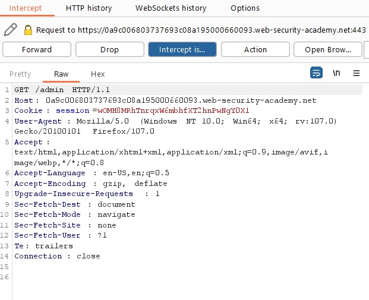

* *Ta nhận thấy còn có một phần có thể bắt request nữa, đó là phần `Update Email`:*

* *Ta thử bắt request với một email bất kì:*

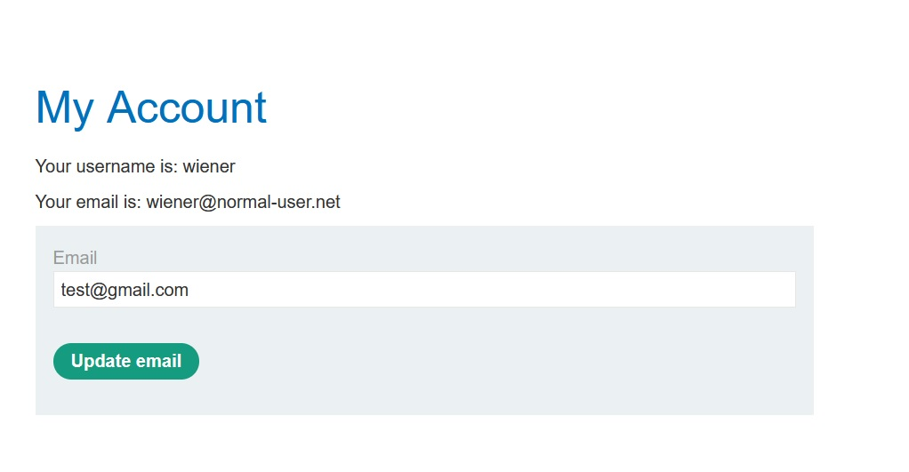

* *Tool `Burp Suite` sẽ trả về request của update email như bên dưới:*

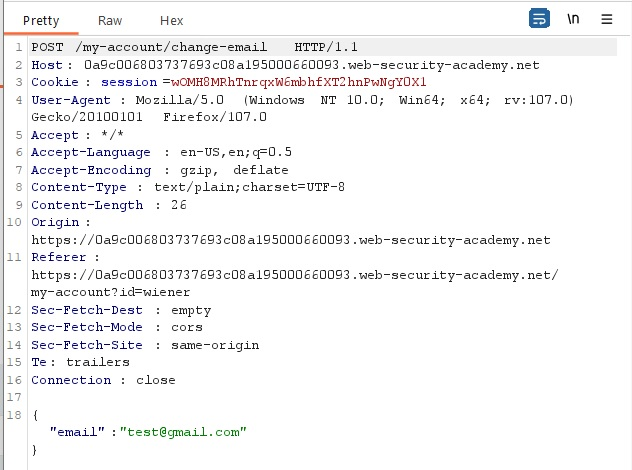

* *Chuyển request sang `Repeater` rồi ấn `Send`, ta sẽ thấy header của roleid sẽ bị ẩn đi, mặc định sẽ là `1` như bên dưới:*

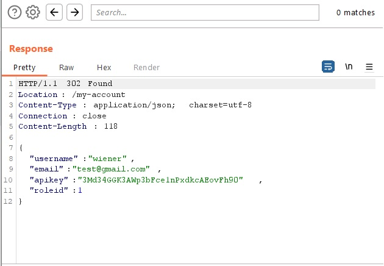

* *Ta thêm `"roleid" :2` vào phần request, lúc này account `weiner:peter` sẽ được cấp role là 2:*

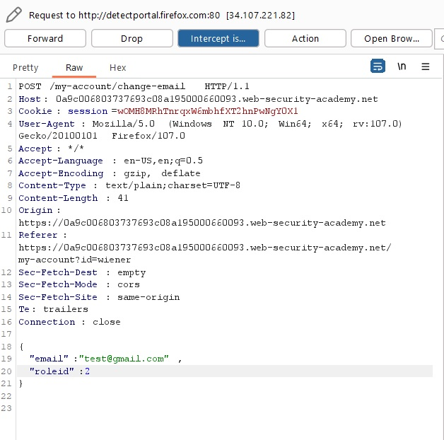

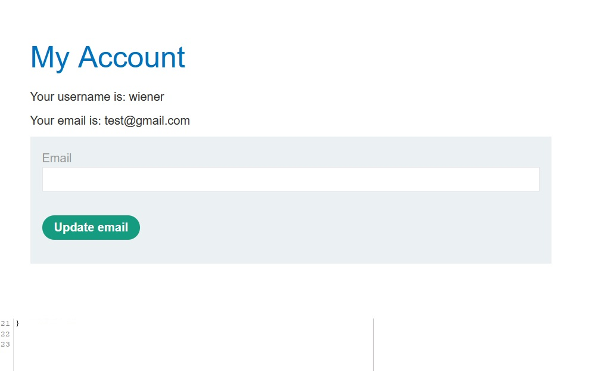

* *Và có thể truy cập được `/admin`:*

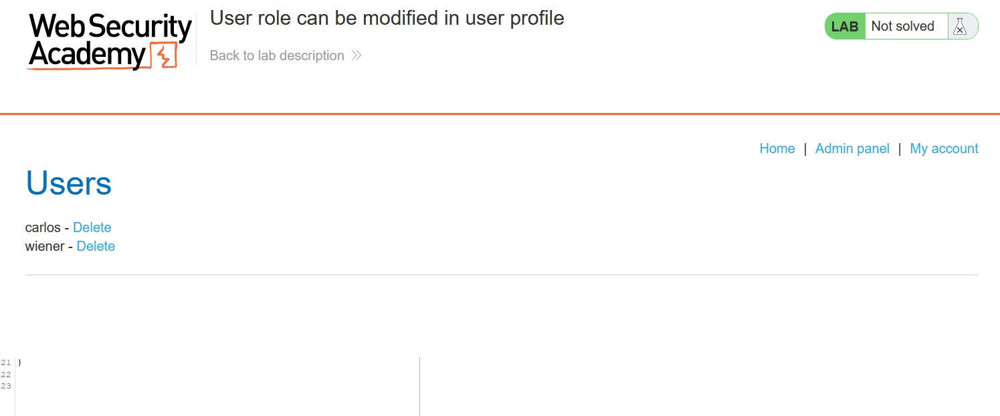

* *Tiến hành xóa user `carlos` và ta đã solved được bài lab này:*

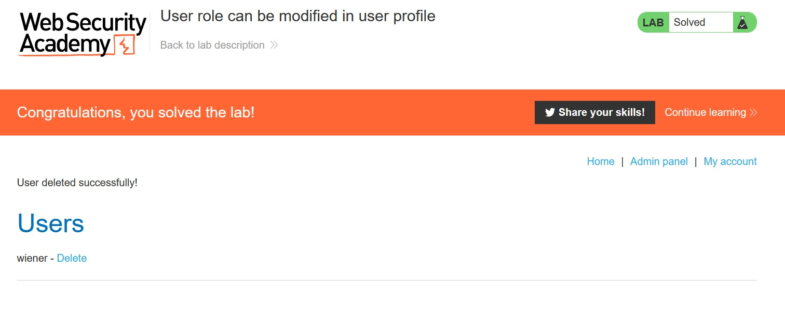