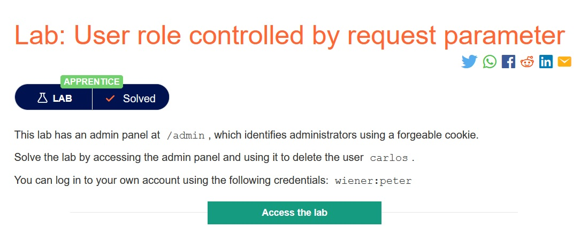
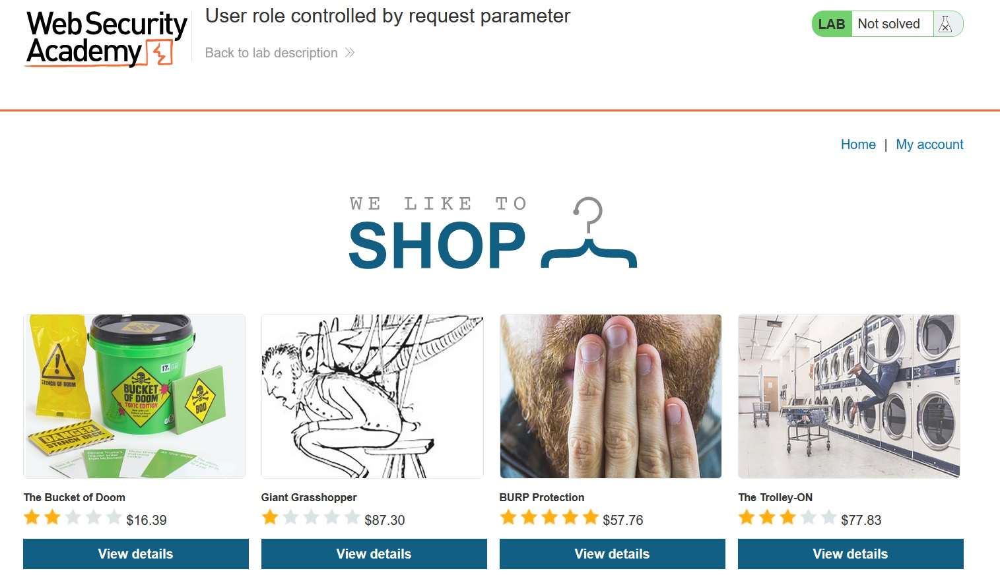
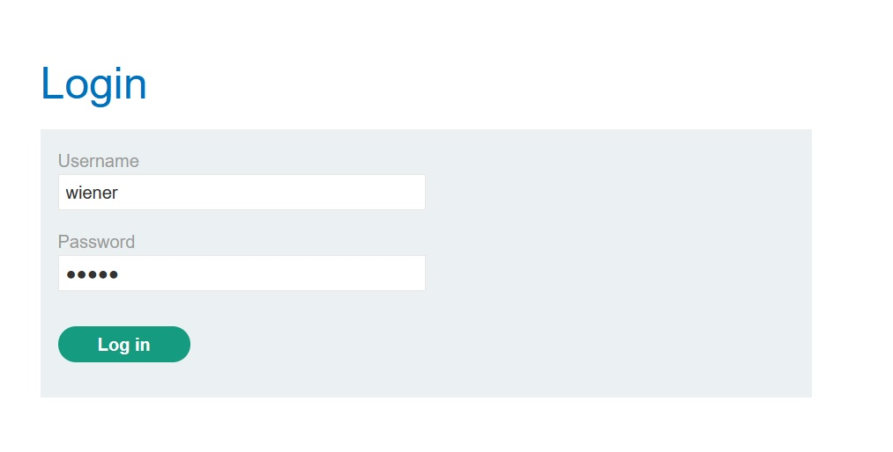
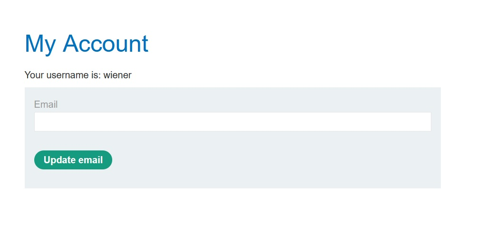
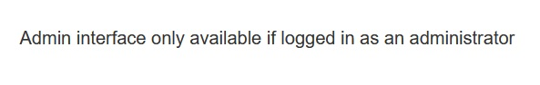
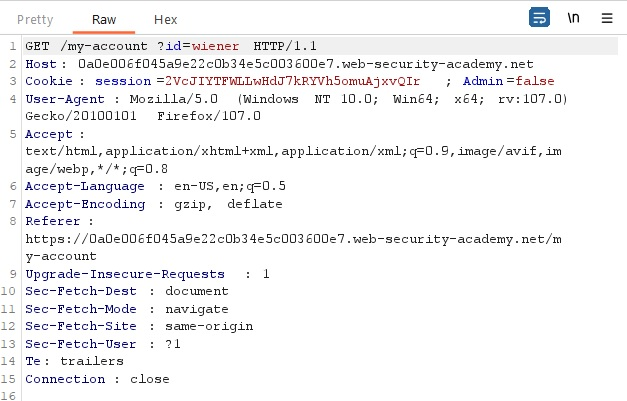
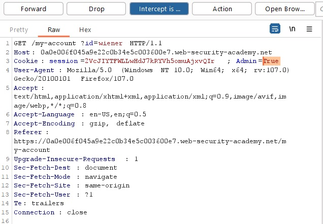
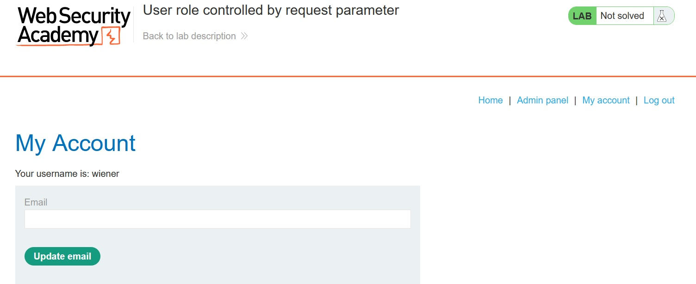
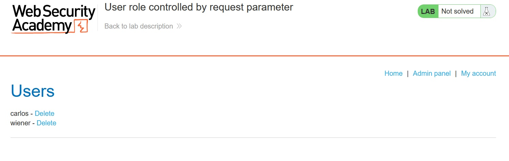
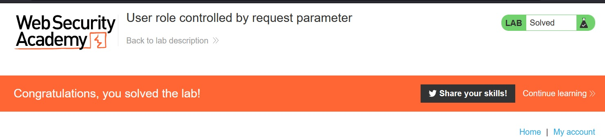

# User role controlled by request parameter

## Description:

[User role controlled by request parameter](https://0a0e006f045a9e22c0b34e5c003600e7.web-security-academy.net/)

> *Theo đề bài mô tả, có một bảng admin ở trang `/admin` nhưng cần xác minh, nhiệm vụ của ta là xóa user `carlos`, ta có thể sử dụng account `wiener/peter`.*

## Solution:

* *Sau khi `Access the lab`, một giao diện web sẽ hiện ra như bên dưới:*

* *Sử dụng account rồi đăng nhập:*

* *Ta thử truy cập vào `/admin` nhưng chỉ khi đăng nhập bằng admin mới có thể sử dụng:*

* *Sử dụng tool `Burp Suite` rồi bắt request, ta có thể thấy value của `Admin=false`:*

* *Thay đổi value `Admin=True` rồi `Forward`:*

* *Trong giao diện của người dùng giờ có thêm choice `Admin panel` hoặc có thể truy cập bằng url `/admin`:*

* *Truy cập và xóa user `carlos`, ta đã solved được bài lab này:*

