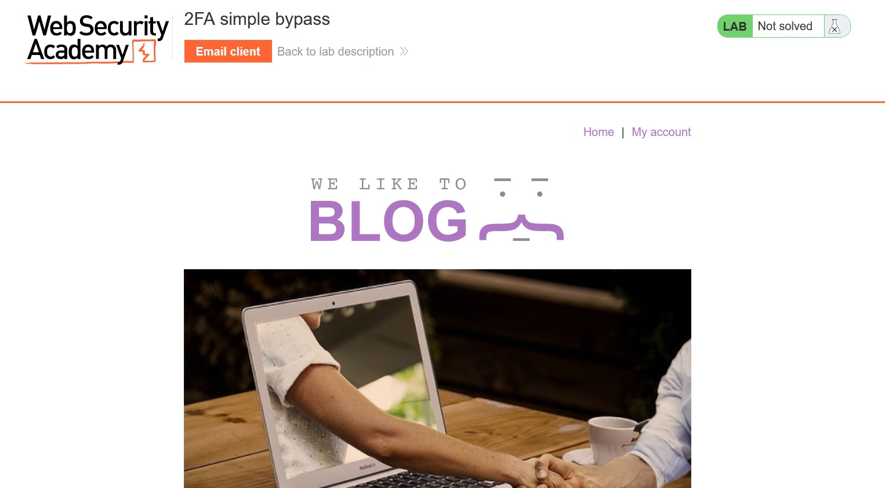
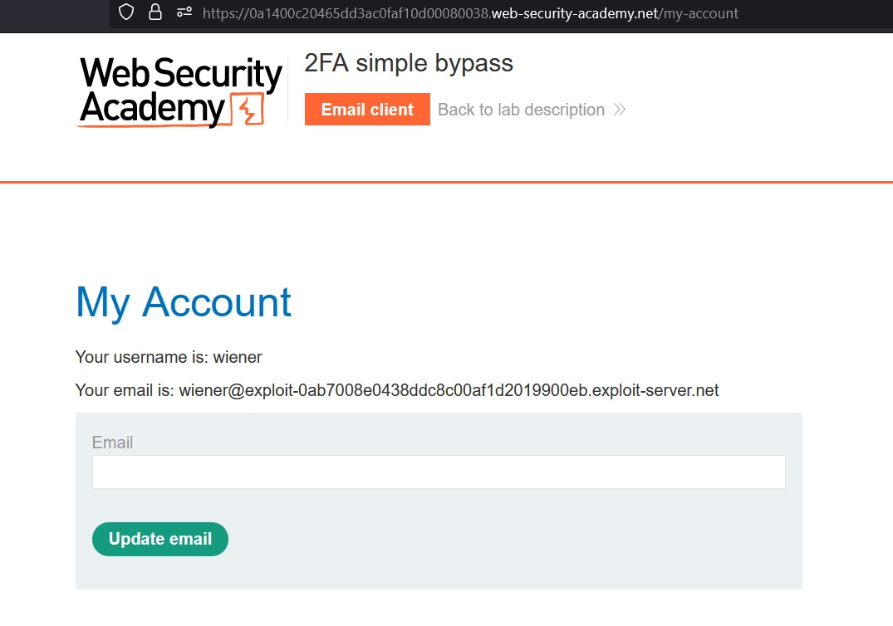
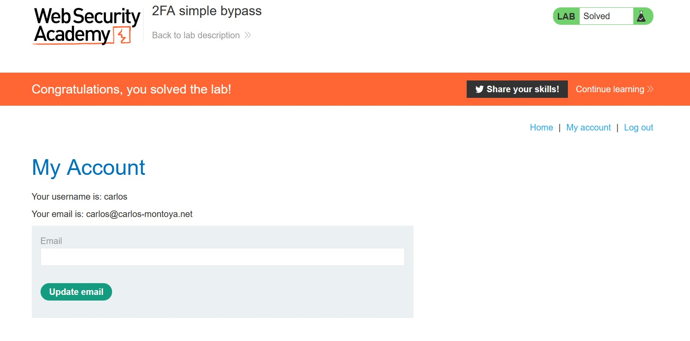

# 2FA simple bypass

## Description:

[2FA simple bypass](https://portswigger.net/web-security/authentication/multi-factor/lab-2fa-simple-bypass)

> *Theo đề bài mô tả, bài lab này có yếu tố xác thực `two-factor` có thể được bỏ qua. Bạn đã có được `username` và `password` của một user là `wiener:peter`, nhưng không thể truy cập được code xác thực 2FA. Nhiệm vụ của ta là truy cập được vào account `carlos`.*

## Solution:

* *Sau khi `Access the lab`, một giao diện sẽ hiện ra:*

* *Login bằng account `wiener:peter`:*

* *Nhưng chưa thể login được vì ta cần một `2FA code` để xác thực. Trong trang của `user` có một tùy chọn sẽ đưa ta đến `Email client`:*

* *Tại đây có chứa code để xác thực:*

* *Nhập mã và ta có thể login được bằng account này:*

* *Ta để ý sau khi login, trên url dẫn đến trang người dùng có `/my-account`:*

* *Login bằng account `carlos:motoya`:*

* *Tại nơi xác thực login, trên url có `/login2`:*

* *Thay đổi `/login2` thành `/my-account` thì ta đã bỏ qua được bước xác thực và login thành công được vào account `carlos:motoya`, đồng nghĩa với việc solved được bài lab này:*

