# Password brute-force via password change

## Description:

[Password brute-force via password change](https://portswigger.net/web-security/authentication/other-mechanisms/lab-password-brute-force-via-password-change)

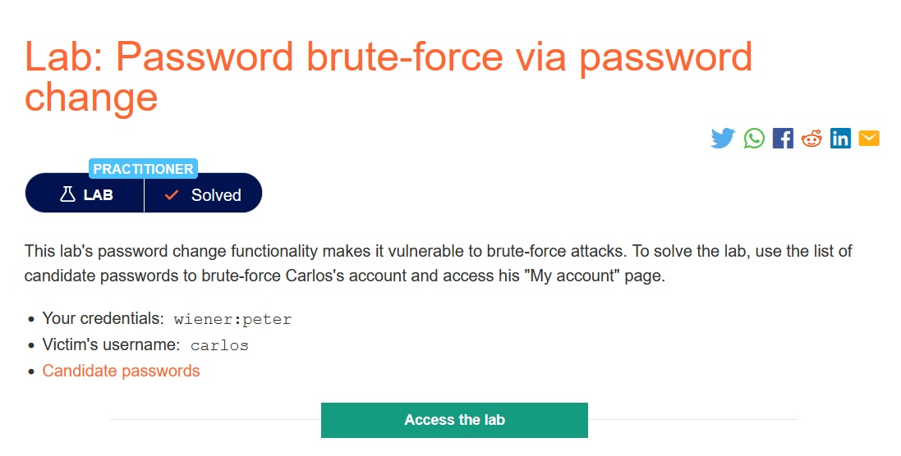

> *Theo mô tả, chức năng đổi mật khẩu của bài lab này có thể bị tấn công `brute-force`. Nhiệm vụ của ta là đăng nhập được vào account `carlos`, sử dụng `brute-force` và list `password` đã được liệt kê. Ta có thể sử dụng account `wiener:peter`.*

## Solution:

* *Sau khi `Access the lab`. một giao diện web sẽ hiện ra:*

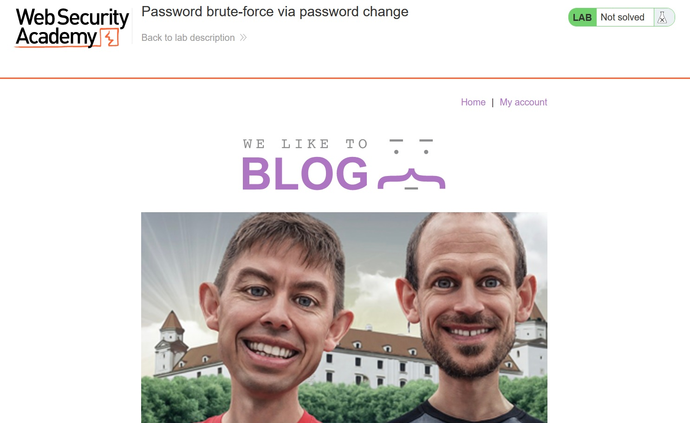

* *Login bằng account `wiener:peter`:*

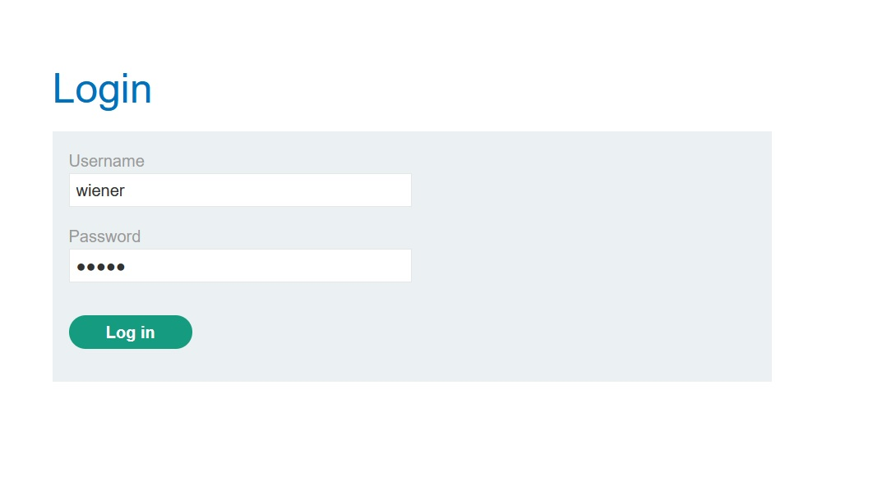

* *Ta thấy có một giao diện thay đổi mật khẩu, trong đó có những ô: `Nhập mật khẩu hiện tại`, `Nhập mật khẩu mới` và `Xác nhận mật khẩu mới`:*

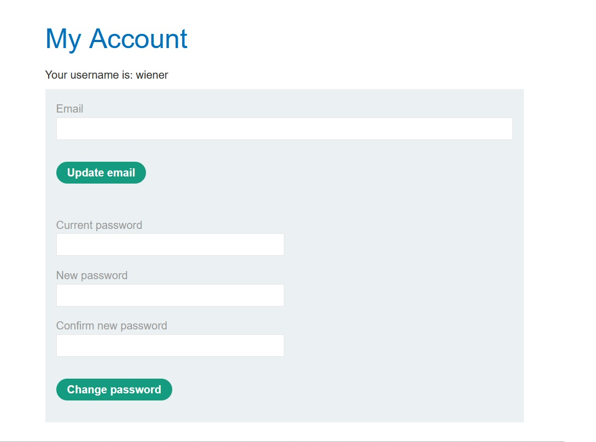

* *Sử dụng tool `Burp Suite` và bắt request khi thay đổi mật khẩu rồi `Send to Repeater`:*

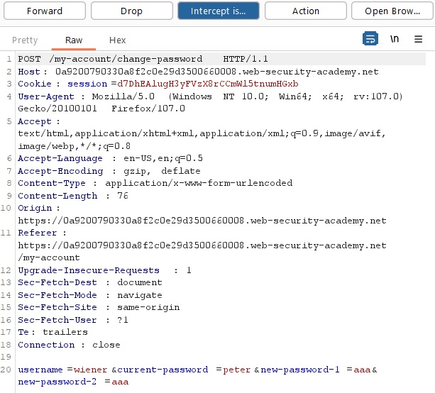

* *Đầu tiên ta thử nhập `Mật khẩu hiện tại` chính xác và `Mật khẩu mới` và `Xác nhận mật khẩu mới` trùng nhau*
  *-> Sẽ trả về `Thay đổi mật khẩu thành công`.*

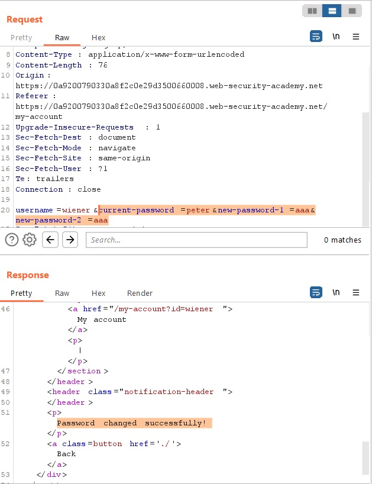

* *Sau đó ta thử nhập `Mật khẩu hiện tại` chính xác và `Mật khẩu mới` và `Xác nhận mật khẩu mới` không trùng nhau*
  *-> Sẽ trả về `Mật khẩu mới không trùng nhau`.*

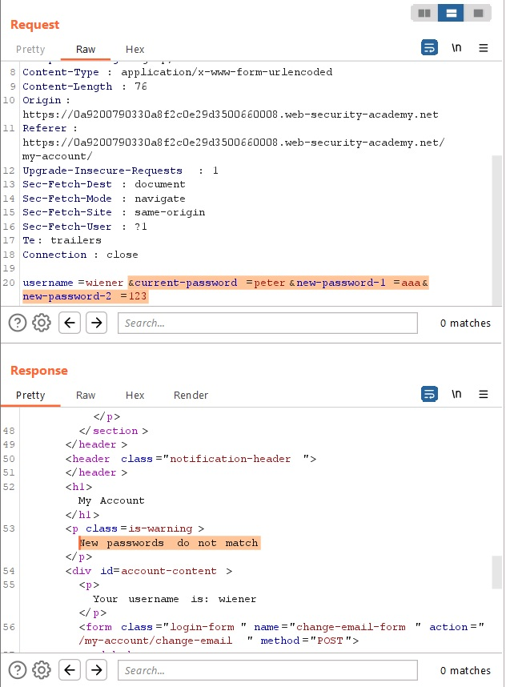

* *Sau đó ta thử nhập `Mật khẩu hiện tại` không chính xác*
  *-> Sẽ trả về `Mật khẩu hiện tại không chính xác`.*

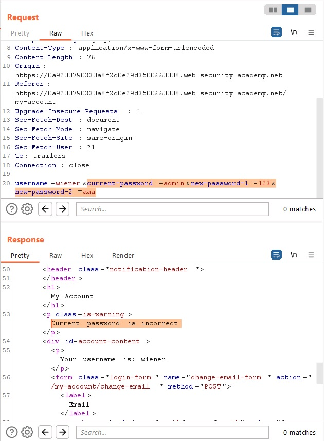

> *Từ những trường hợp trên ta có thể suy ra, nếu nhập mật khẩu hiện tại đúng thì sẽ trả về `Mật khẩu Mật khẩu mới không trùng nhau`.*

* *Sử dụng `Intruder`, thay đổi value `username = carlos`, nhập `Mật khẩu mới` và `Xác nhận mật khẩu mới` không trùng nhau và tiến hành `brute-force`.*

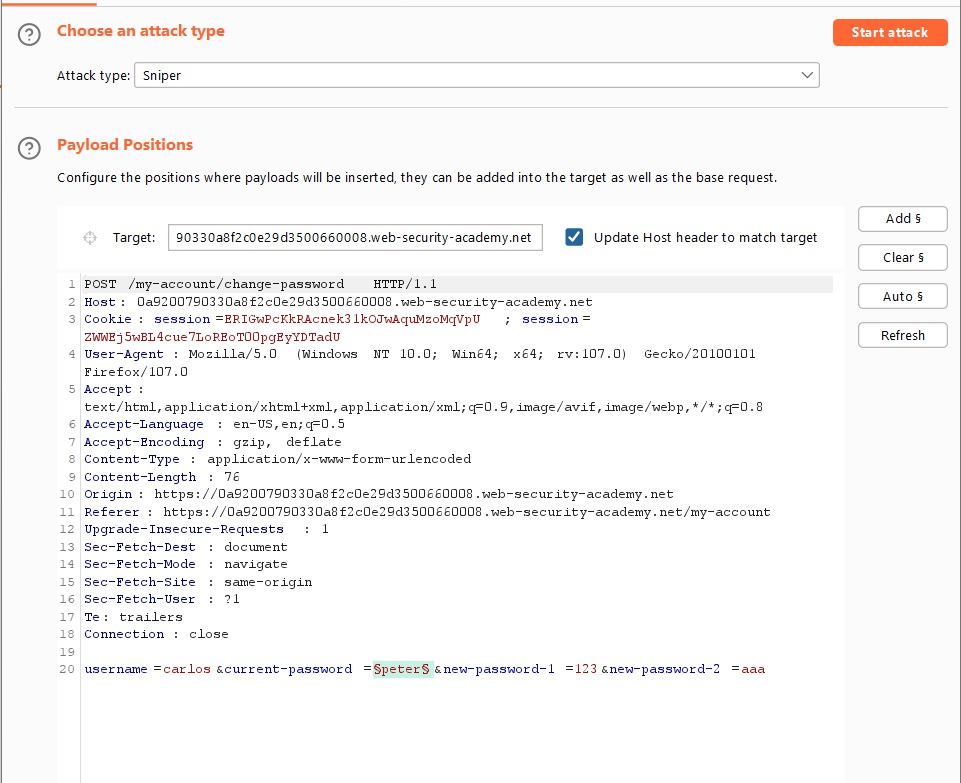

* *Thêm những `password` mà đã được liệt kê sẵn:*

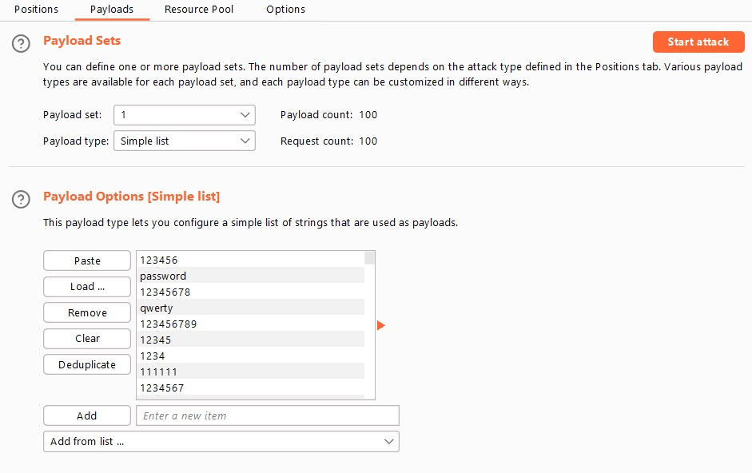

* *Ở tab `Options`, phần `Grep-Match`, thêm dòng `New password do not match.` để ta có thể filter những value có Response trả về xuất hiện dòng này rồi `Start attack`:*

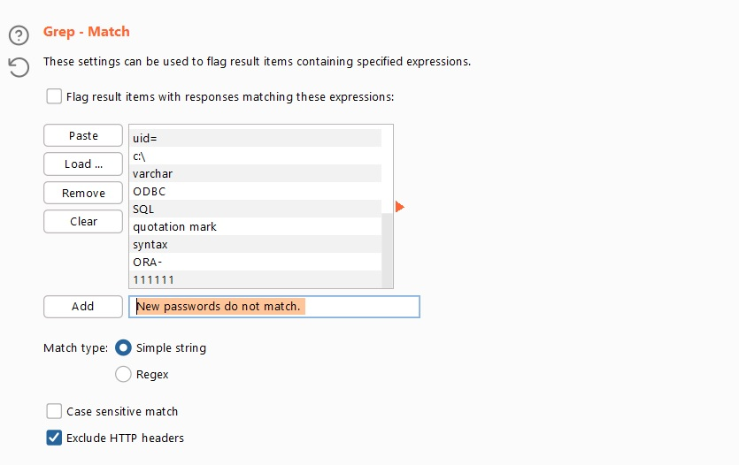

* *Sau khi `brute-force` xong, filter ta thấy có một value trả về có Response xuất hiện dòng `New password do not match.`:*

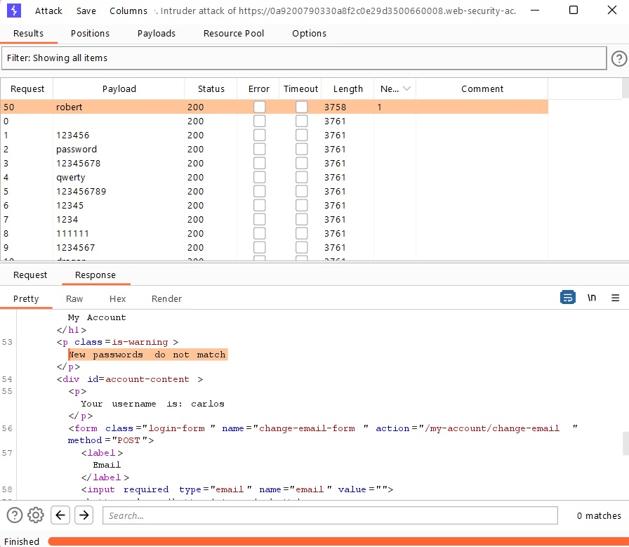

* *Sau khi có được `password`, tiến hành login bằng account `carlos` và ta đã solved được bài lab này:*

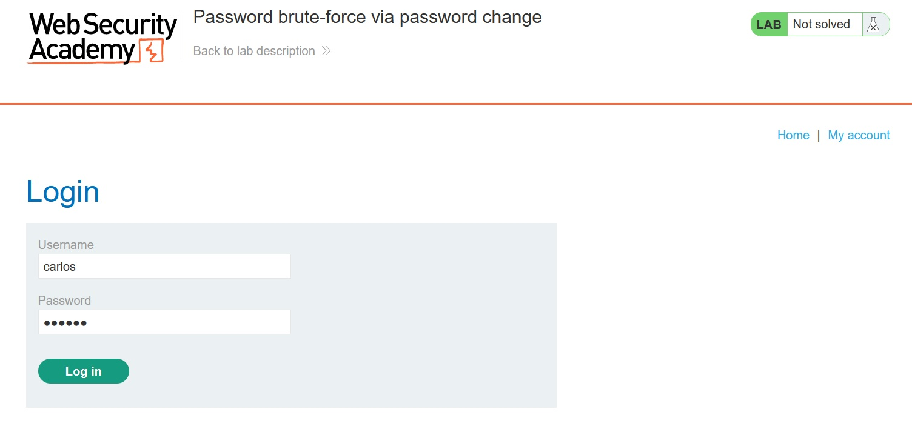

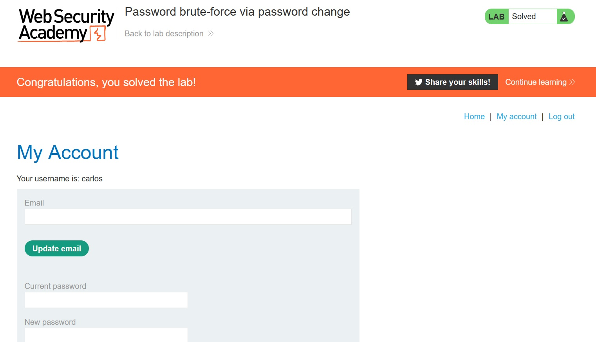