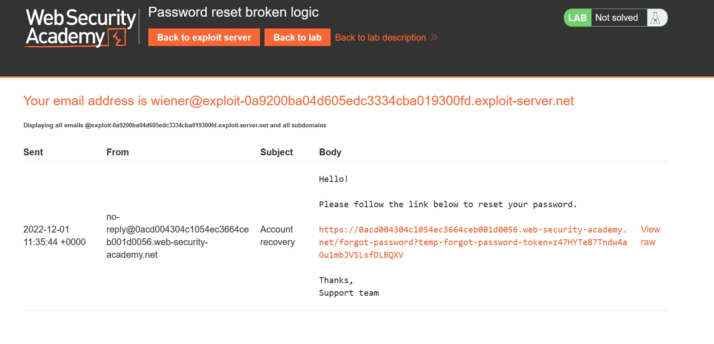

# Password reset broken logic

## Description:

[Password reset broken logic](https://portswigger.net/web-security/authentication/other-mechanisms/lab-password-reset-broken-logic)

> *Theo đề bài mô tả, lab này có chức năng reset mật khẩu có thể bị tấn công. Nhiệm vụ của ta là reset mật khẩu của user `carlos` sau đó login và truy cập trang `My account` của tài khoản này:*

## Solution:

* *Sau khi `Access the lab`, một giao diện web sẽ hiện ra:*

* *Ở giao diện login, có phần `Forgot password?`:*

* *Nhập `wiener` vào phần username vì `Email client` để mặc định là của user `wiener`:*

* *Ở giao diện `Email client` có một đường link dẫn ta đến giao diện nhập password mới:*

* *Nhập password bất kì rồi sử dụng tool `Burp Suite` bắt request:*

* *Ta thấy ở phần request có tham số `temp-forgot-password-token` không đổi mỗi khi ta reset password:*

* *Ta thay đổi value của user từ `wiener` thành `carlos` còn password có thể giữ nguyên:*

* *Tiến hành login bằng account `carlos:123` và ta đã solved được bài lab này:*

