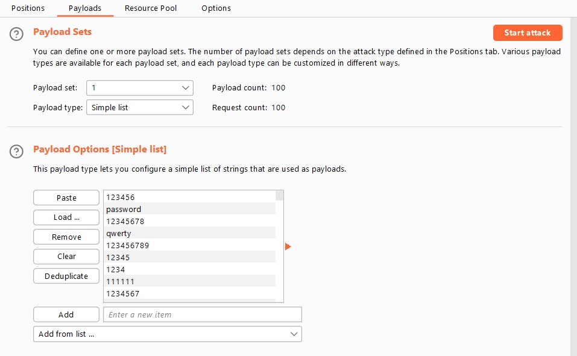

# Username enumeration via different responses

## Description:

[Username enumeration via different responses](https://portswigger.net/web-security/authentication/password-based/lab-username-enumeration-via-different-responses)

> *Theo đề bài mô tả, lab này có thể tấn công bằng phương pháp `brute-force`. Nhiệm vụ là tìm ra được username hợp lệ rồi tìm ra password rồi login bằng account tìm ra được.*

## Solution:

* *Sau khi `Access the lab`, một giao diện web sẽ hiện ra:*

* *Nhập một `username` và `password` bất kì và sử dụng tool `Burp Suite` bắt request của phiên login này:*

* *Chuyến sang tab `Intruder` để tiến hành tấn công `brute-force`:*

* *Trước tiên, tiến hành tấn công `brute-force` username để tìm ra username hợp lệ:*

* *Ở mục `Payload`, sử dụng những username mà theo mô tả đã cho sẵn:*

* *Sau khi `brute-force`, filter `Status` và `Length` và ta thấy có một username trả về `Length` khác:*

* *Và phần `Respone` trả về `Invalid Password` trong khi những phần khác trả về `Invalid Username`, chứng tỏ `username` này là hợp lệ:*

* *Khi đã có `username` hợp lệ, ta tiến hành `brute-force` `password`:*

* *Sử dụng những `password` mà phần mô tả đã cho sẵn:*

* *Sau khi `brute-force`, ta thấy có một `password` trả về `Status` và `Length` khác với các `password` còn lại:*
 

* *Tiến hành login bằng `username` và `password` ta đã tìm ra,solved thành công bài lab này:*

