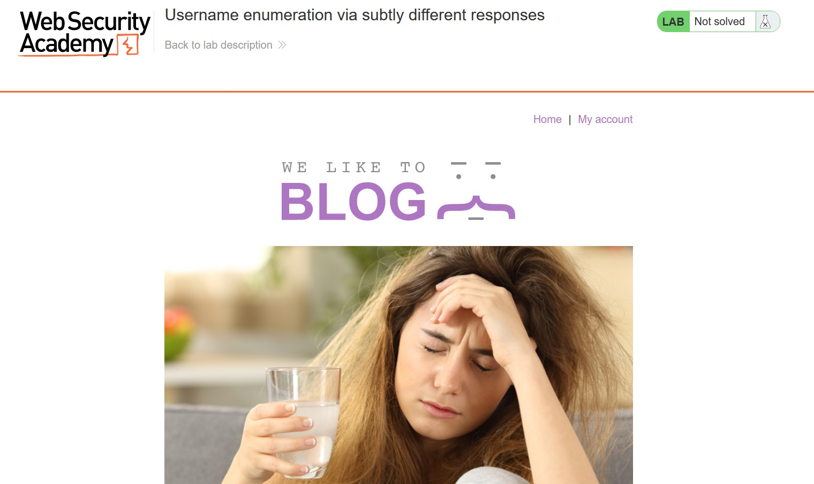

# Username enumeration via subtly different responses

## Description:

[Username enumeration via subtly different responses](https://portswigger.net/web-security/authentication/password-based/lab-username-enumeration-via-subtly-different-responses)

> *Theo mô tả, bài lab này có `username` và `password` có thể tấn công bằng `brute-force`. Nhiệm vụ của ta là tìm ra account này rồi login vào.*

## Solution:

* *Sau khi `Access the lab`, một giao diện web sẽ hiện ra:*

* *Nhập một `username` và `password` bất kì:*

* *Rồi sử dụng tool `Burp Suite` để bắt request login:*

* *`Send to Repeater`, ta thấy ở phần Respone, khi nhập sai  thông tin thì sẽ trả về `Invalid username or password.` nên khi `brute-force` ra username hợp lệ sẽ không trả về `Invalid password`:*

* *Tiến hành `brute-force` `username`:*

* *Ở phần `Payload`, thêm những username mà đề bài đã cho sẵn:*

* *Ở phần `Options` kéo đến `Grep - Extract` rồi `Add`:*

* *Sẽ ra một bảng tùy chọn, ta sẽ chọn những thông tin mình muốn tìm ở Respone, nhấn `Fetch response`:*

* *Kéo đến khi thấy dòng `Invalid username or password.` rồi bôi đen, ấn `OK`:*

* *Sau khi `Start attack`, sẽ hiện ra bảng kết quả, filter ta sẽ thấy có một value sẽ trả về response khác với những username còn lại `Invalid username or password` và không có dấu `.`*

* *Sau khi tìm ra được `username` hợp lệ, ta tiến hành `brute-force` để tìm ra `password` hợp lệ:*

* *Sử dụng những `password` đã được liệt kê:*

* *Sau khi `brute-force`, ta thấy có một value trả về `Stutus` và` Length` khác với những value còn lại:*

* *Login bằng account vừa tìm ra và ta đã solved được bài lab này:*

