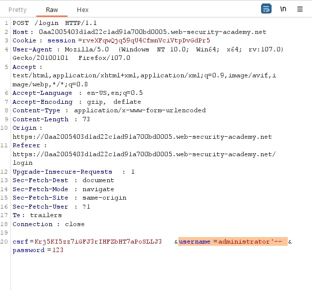

# SQL injection vulnerability allowing login bypass

## Description:

[SQL injection vulnerability allowing login bypass](https://portswigger.net/web-security/sql-injection/lab-login-bypass)

> *Theo đề bài mô tả, lab này có lỗ hổng `SQL` ở chức năng login. Nhiệm vụ của ta là sử dụng lỗ hổng này và đăng nhập vào user `administrator`.*

## Solution:

* *Sau khi `Acess the lab`, một giao diện web sẽ hiện ra:*

* *Sử dụng tool `Burp Suite` để bắt request phiên login bằng user `administrator` và password bất kì:*

* *Vì đây là lỗ hổng `SQL` nên ta thay đổi request thành `username=administrator'--`:*

> *`username=administrator'--` vì đặt username là administrator, dấu nháy để kết thúc câu truy vấn `SQL` và -- để bỏ qua những para còn lại của câu truy vấn*

* *Sau khi `Forward`, ta đã login được vào user `administrator` và solved được bài lab này:*

